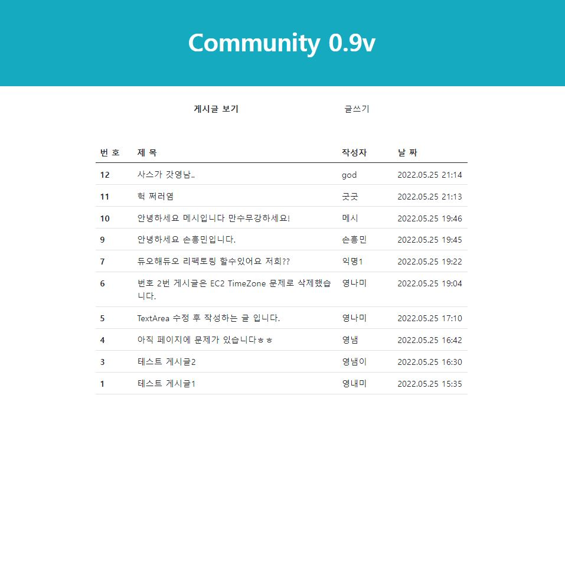
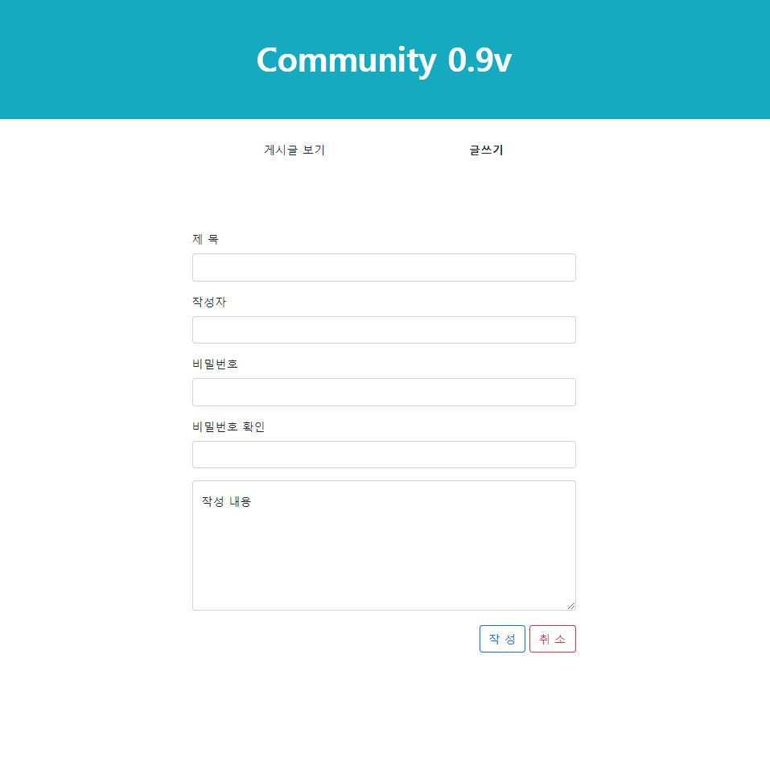

# 설계 방향

## 요청 방식 및 RESTful 이유

### 1. 수정, 삭제 API의 request 방식

- @PathVariable로 수정, 삭제하려는 게시글의 id를 얻음
- @RequestBody를 통해 수정, 삭제하려는 게시글의 수정 내용과 비밀번호를 얻음

### 2. 요청에 따른 request 사용

- 단순 조회는 URL '경로 변수(pathvariable)', 'param' 그리고 'query'로 필요한 정보를 보내 요청을 함
- 데이터 저장, 수정, 삭제 시 그리고 더욱이 민감한 정보를 포함한다면 HTTP 메시지 'Body'에 실어 보내는 요청을 함

### 3. RESTful한 API에 관한 고민

- 구현 시작 전에 아래 보이는 링크에서 볼 수 있는 것과 같이 테이블의 간단 정의와 API 설계를 하였음.
- DB 테이블에서 볼 수 있듯이 테이블은 단 하나이고 클라이언트에서 필요 시 그에 대한 정보를 요청하고 서버에서 전달하기 때문에 
“/boards” URL로 정보를 식별하게 하였고 이후 조회, 저장, 수정, 삭제 행위에 걸맞는 HTTP Method를 지정하였음.

---

## DB Table 간단 정의 및 API 문서

[간단 DB 테이블 정의](https://www.notion.so/30dd0b84773543de908e4cb43a4d26c4)

[API_문서](https://www.notion.so/497752e273484339a6fedb9756b6af20)

---

## 화면 소개

### 메인 페이지

### 글작성 페이지

### 상세 게시글 페이지

